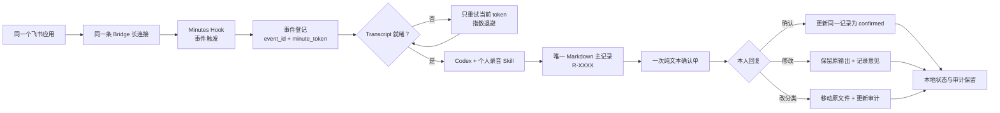

# Recording Agent Starter Flow

控制面的去重、退避、路径、状态、文件名和移动均由确定性程序处理。Codex 只负责在给定
Transcript 与分类边界内整理结构化内容；本人负责确认、纠正、分类与最终责任。

`sample` 使用 bundled safe fixture，走同一 Markdown 输出契约，但不经过飞书、真实
Codex 或消息发送，因此不能替代真实 E2E。
