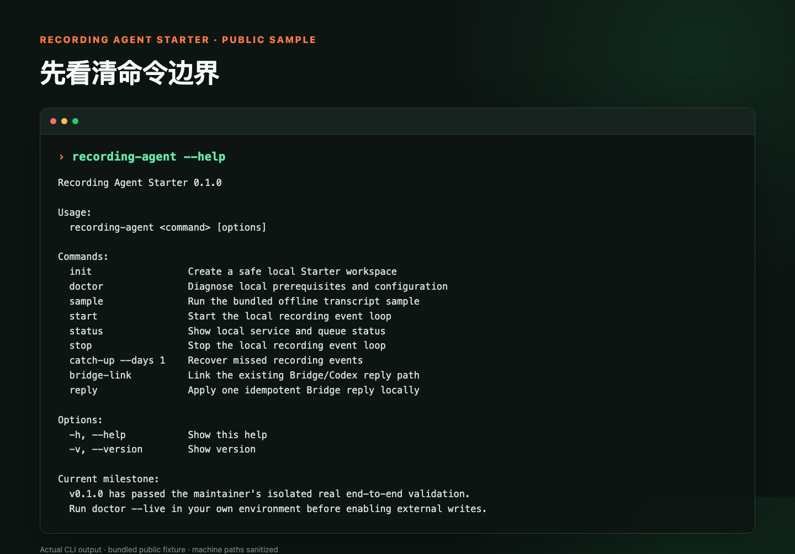
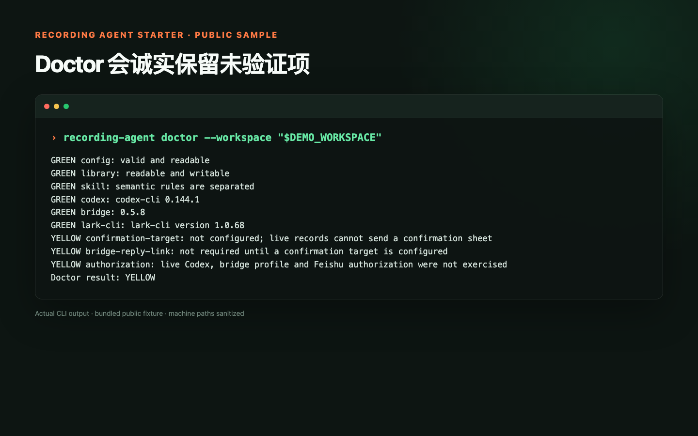
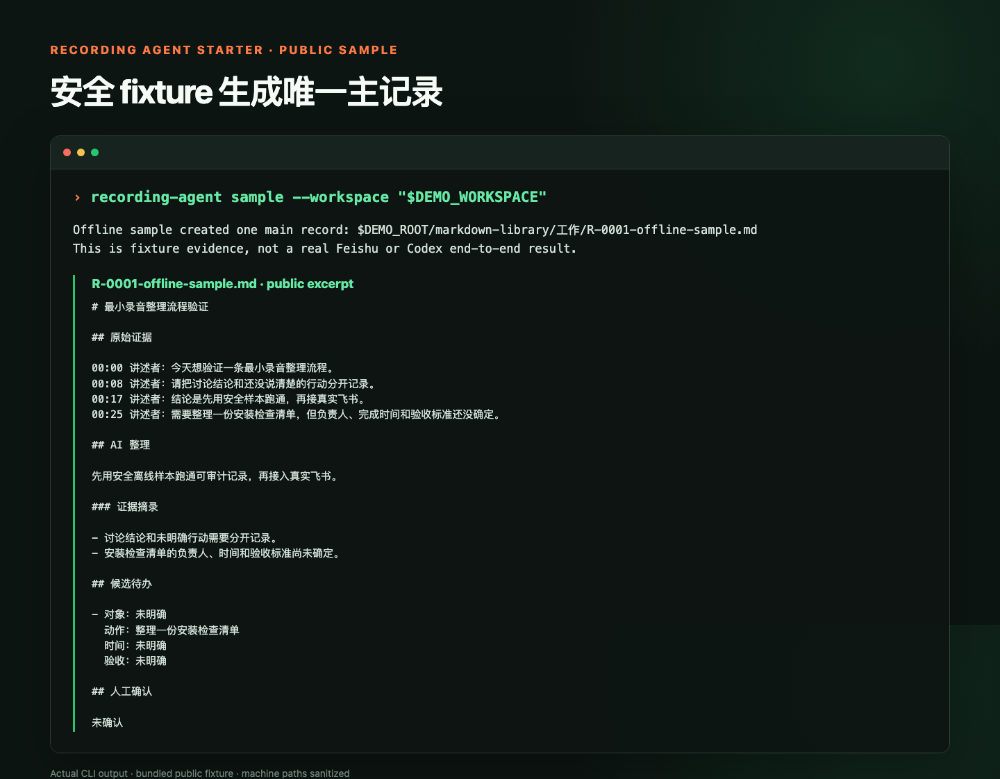

# Public Sample Screenshots

These screenshots are generated from the built CLI and the repository's bundled safe fixture.
They contain no real recording, Feishu message, token, user ID, machine path or private knowledge
base. Machine paths are explicitly replaced with `$DEMO_ROOT`.

Regenerate after building:

```bash
node workshop/scripts/capture-public-screenshots.mjs
```

## CLI boundary



## Honest offline doctor

`doctor` keeps unverified live authorization and confirmation delivery in YELLOW instead of
presenting fixture evidence as a real E2E result.



## One auditable sample record

The bundled public fixture creates one `R-0001` record and explicitly says it is not a real Feishu
or Codex E2E result.


